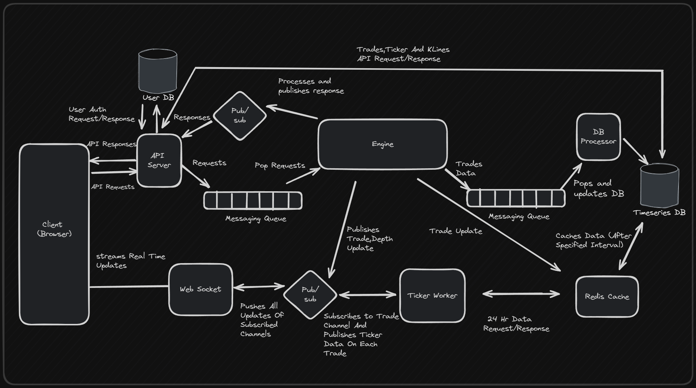

# Exchangify: High-Performance Trading Platform

Exchangify is a scalable, real-time asset exchange platform built with modern web technologies and a distributed systems architecture.

## Architecture Overview

## Backend Architecture

Our backend is composed of several microservices, each with a specific role:

1. **API Server**: Handles HTTP requests from users.

   - Technology: Express.js
   - Puts requests in a messaging queue
   - Subscribes to a pub/sub for responses
   - Forwards responses to clients

2. **Engine**: Core of the trading platform.

   - Processes requests from the messaging queue
   - Manages multiple market orderbooks
   - Stores user balances in memory
   - Processes orders in real-time
   - Publishes DB-related messages to a separate queue
   - Publishes real-time updates (depth, trade) to a pub/sub
   - Caches each trade in Redis for DB and cache consistency
   - Technology: Node.js

3. **WebSocket Server**: Manages real-time event subscriptions.

   - Subscribes to pub/sub for real-time updates
   - Streams live updates to users (e.g., ticker, depth, trades)

4. **DB Processor**: Handles data persistence.

   - Processes messages from the Engine's DB queue
   - Asynchronously updates the database

5. **Ticker Worker**: Manages ticker information.

   - Processes trade data
   - Retrieves initial ticker info from the database
   - Caches ticker data in Redis
   - Serves subsequent requests with cached data

6. **Redis**:

   - Manages message queues and pub/sub functionality
   - Facilitates communication between services
   - Caches ticker data and trades for low-latency access and consistency

7. **TimescaleDB**: Specialized time-series database.

   - Stores historical trade data
   - Creates buckets of klines based on price feed
   - Optimized for time-series data queries

8. **User Database**:
   - Stores user account information
   - Manages user authentication data

## Frontend

- Built with Next.js and Tailwind CSS
- Provides a responsive and interactive user interface
- Includes Candle Stick Chart using Light Weight Charts
- Uses Next-Auth for out-of-the-box authentication

## Key Features

- High-throughput, low-latency order processing
- Real-time market data streaming (ticker, depth, trades)
- Scalable and fault-tolerant distributed architecture
- Asynchronous database updates for improved performance
- Efficient ticker data caching for reduced database load
- Secure user authentication with Next-Auth

## Demo Video

- Main Trades Page
  

## Setup and Usage

- Ensure you have Node.js and Docker installed on your system.

- Clone the repository

- Navigate to the db directory:

  `cd db`

- Run the following command to seed the databases:

  `npm run install`

  `npm run seed:db`

  `npm run seed:userDb`

- Navigate to the root directly:

  `cd ..`

- Run the following command to install the top-level packages:

  `npm install`

- Update all .env files

- Run the following command to setup (install packages) all services:

  `npm run setup`

- Run the following command to start all services:

  `npm run start`
